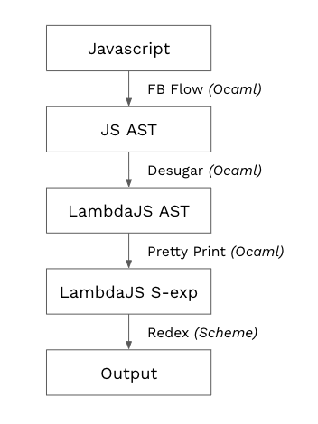

# LambdaJS

LambdaJS is small, tested, reduction semantics for JavaScript. It was proposal by
Brown PLT group in 2010. See their [paper](http://cs.brown.edu/~sk/Publications/Papers/Published/gsk-essence-javascript/). 

This repo reproduces the translation (*"desguar"*) between JavaScript and LambdaJS using **Ocaml**.


## Pipeline


1. JavaScript is processed by [Flow Parser](https://flow.org/) first to generate [JS AST](https://github.com/facebook/flow/blob/master/src/parser/flow_ast.ml). 
2. The translation is working on the JS AST, and the output is [LambdaJS AST](https://github.com/Lw-Cui/lambdaJS/blob/master/lib/desugar.ml). That is the core part of this repo.
3. A small utility is written to serialize the LambdaJS AST to S-expression.
4. LambdaJS S-expression interpreter is adopted from original LambdaJS [codebase](https://github.com/brownplt/LambdaJS), hence the desugar result can be executed and tested directly.

## Build

Please install `opam` (OCaml >= v4.07) and `Racket`(>= v7.2) first. You can find guide for `opam` [here](https://pl.cs.jhu.edu/fpse/coding.html).

Then install necessary libraries:
```
opam install merlin user-setup menhir utop ppx_deriving ounit2 qcheck
opam pin add flow_parser https://github.com/facebook/flow.git
```

Finally,
```
dune build      # build the lib
dune runtest    # and run all unit tests!
```

## Run

You can translate JS in `example/qsort.js` and run generated lambdaJS directly by:
```
cat ./examples/qsort.js | dune exec ./src/translate.exe | ./interp/interp-shell.ss  
```

`dune exec` completes pipeline 1-3 and `interp-shell` finishes pipeline 4.

Below lists supported feature with code snippet. All of them are in `example` directory. You can replace the js file in above command and run it.

* Arithmetic: [arithmetic.js](./example/arithmetic.js)
* If statement: [condition.js](./example/condition.js)
  * Without alternative: [simple_cond.js](./examples/simple_cond.js)
* While statement: [while.js](./examples/while.js)
* Array: [array.js](./examples/array.js)
  * Array index: [array_index.js](./examples/array_index.js)
* Dictionary: [dict.js](./examples/dict.js)
  * Delete ops: [dict_delete.js](./examples/dict_delete.js)
  * Field manipulation: [arithmetic_dict.js](./examples/arithmetic_dict.js)
* Function: [argument_passing.js](./examples/argument_passing.js)
  * Function argument: [argument_changing.js](./examples/argument_changing.js)
  * High-order function: [high_order.js](./examples/high_order.js)